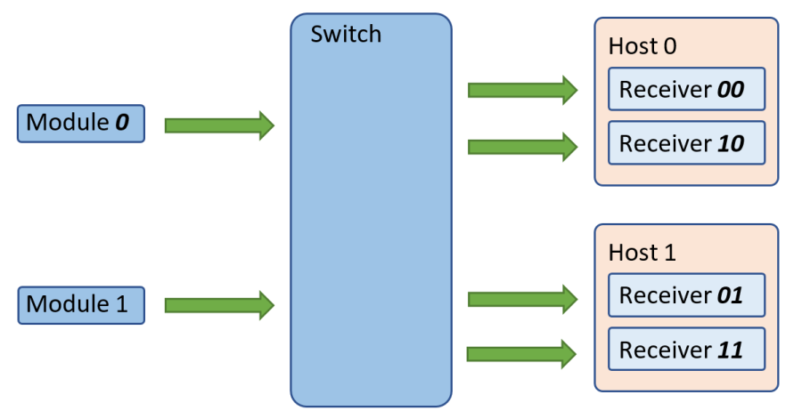
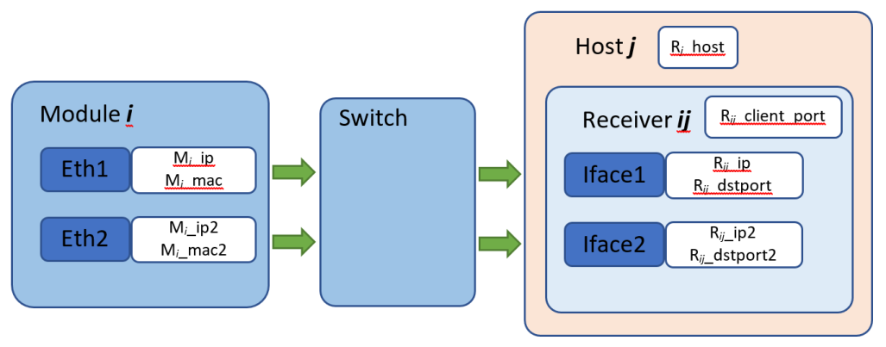

# Round Robin requirements for ESRF, to be used on ID29 Jungfrau-4M

## Introduction
The integration of the PSI/Jungfrau-4M detector to the ID29 control system is a new challenge due to the 8 GByte/s of raw data to be received by the backend computer(s), which will be reduced online. The goal of Lima2 is to provide a scalable framework that allows 2D detector DAQ, including processing, in a distributed computing environment. In this context, the Round Robing mechanism, dispatching detector data to different DAQ nodes, will optimize the IT resources so the Lima2 implementation would effectively be scalable.

## Multi-module receiver
It is recommended to first add the functionality described in the `Multi-Module Receiver` proposal before adding this one. It improves the performance and reduces the complexity of the implementation.

## Topology
The example below shows the topology of a system with `M={2,1}` detector modules and `N=2` backend hosts. The number of modules per receiver is `O={1,1}`.


 
### Multiple receivers per host
This document only exposes the simple case of a single receiver per host: `L=1`. Implementing a configuration where `L > 1` (like the one proposed for ID29 Jungfrau-4M) just requires replacing `N` -> `N x L` and iterating the `j` index in the range `0..(N x L)-1`.

## Data transfer nodes
The following picture shows the configuration parameters required to transfer the data from detector module `i` to data receiver `ij`, running in host `j`: 



## Configuration file
The parameters in the diagram above could be specified in a configuration file like this:

```
# M (Half-)Modules, O Modules/Receiver, N Hosts -> M / O x N Receivers

hostname m0+m1+...mM-1+

roundrobinrecvs <N>

# i: module (0..M-1), j: receiver (0..N-1)

i:udp_srcip <Mi_ip>
i:udp_srcip2 <Mi_ip2>       # for Jungfrau only
i:udp_srcmac <Mi_mac>
i:udp_srcmac2 <Mi_mac2>     # for Jungfrau only
i:j|udp_dstip <Rij_ip>
i:j|udp_dstip2 <Rij_ip2>    # for Jungfrau only
i:j|udp_dstport <Rij_port>
i:j|udp_dstport2 <Rij_port2>
i:j|rx_tcpport <Rij_client_port>
```

Such example requires two new features:

1. The `roundrobinrecvs` parameter specifies the number of receivers that the module needs to send the data to, which defaults to `1`
2. An extended syntax allowing an additional Round Robin index `j` that specifies the receiver the parameter applies to. The proposal is to add an extra `j|` optional token between the module index and the parameter name. Another separator character like `,` could be used as well, as long as it is not `:`. The use of different separators for `i` and `j` is to be able to determine which is specified when only one of them is provided.

## *slsDetectorPackage* API
The following changes are proposed to the *slsDetectorPackage* API in order to implement this feature.

### Detector client API
In order to add the functionality in the configuration file above, the detector client API must be extended. A new function specifying the number of Round Robin receivers N will be needed: 

```c++
void setRoundRobinReceivers(int num_rr_recvs);
```

In the same way, the signatures of the functions affecting the Round Robin detector and receiver configuration need to be extended. One simple solution could be to add an additional `rr` vector parameter with the Round Robin receiver indexes:

```c++
Positions rr = {}
```

which defaults, if empty, to `{0..N-1}`. The order in which pos (corresponding to i) and rr (j) indexes are iterated will directly affect the functions returning configuration parameters in the `Result` vectorized format. An intuitive convention would be to iterate `pos` as the *slow* index and `rr` as the *fast* one:

```c++
sls::Result<RT> ParallelRecv(RT (sls::Module::*somefunc)(CT...),
                             std::vector<int> positions,
                             std::vector<int> rrindexes,
                             typename NonDeduced<CT>::type... Args) {

    if (detectors.empty())
        throw sls::RuntimeError("No detectors added");
    if (positions.empty() ||
        (positions.size() == 1 && positions[0] == -1)) {
        positions.resize(detectors.size());
        std::iota(begin(positions), end(positions), 0);
    }
    if (rrindexes.empty() ||
        (rrindexes.size() == 1 && rrindexes[0] == -1)) {
        rrindexes.resize(num_round_robin_recvs);
        std::iota(begin(rrindexes), end(rrindexes), 0);
    }
    std::vector<std::future<RT>> futures;
    futures.reserve(positions.size() * rrindexes.size());
    for (size_t i : positions) {
        if (i >= detectors.size())
            throw sls::RuntimeError("Detector out of range");
        for (size_t j : rrindexes) {
            if (j >= num_round_robin_recvs)
                throw sls::RuntimeError("RR-receiver out of range");
            futures.push_back(std::async(std::launch::async, somefunc,
                                         detectors[i].get(), j,
                                         Args...));
        }
    }
    sls::Result<RT> result;
    result.reserve(futures.size);
    for (auto &i : futures) {
        result.push_back(i.get());
    }
    return result;
}
```

### Receiver client API (internal)

The receiver client API (used internally by the detector client) just requires the addition of a new call specifying the number of Round Robin receivers N and its index j in the list:

```c++
void setRoundRobinRecv(int num_rr_recvs, int rr_idx)
```

with `Command identifier: F_SET_RECEIVER_ROUND_ROBIN`

## Performance considerations

Performance issues need to be discussed.

The Jungfrau-4M @ 2 KHz generates 160 Gb/s of data. High bitrate (> 50 GB/s) is known to be **not sustainable with a typical single threaded listener**. With this traffic, bypassing the kernel is mandatory -think [DPDK](dpdk.org), [RiverMax](https://developer.nvidia.com/networking/rivermax).

